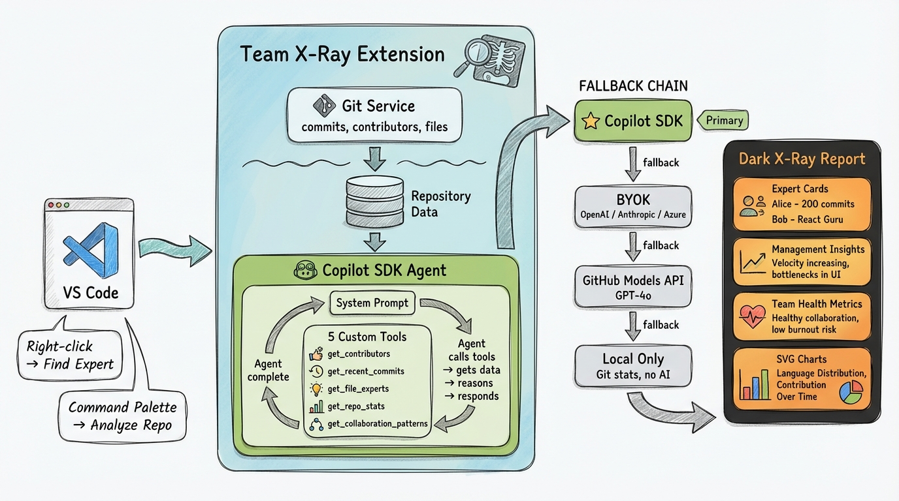

# Team X-Ray

> *"Feeling like a stranger on my own team, surrounded by brilliant minds whose talents hide in code and commits."*

Transform your repository into a team expertise map. Discover who knows what, reveal hidden collaboration patterns, and get AI-powered management insights — all from your git history.

[](https://marketplace.visualstudio.com/items?itemName=AndreaGriffiths.teamxray)

## Features

- **🔍 File Expert Discovery** — Right-click any file to find who knows it best
- **🧠 Team Expertise Analysis** — AI-powered profiles with communication styles, specializations, and collaboration patterns
- **📊 Management Insights** — Actionable recommendations: bus factor risks, growth opportunities, efficiency gaps
- **🤖 GitHub Copilot SDK Integration** — Uses the Copilot SDK with custom tools for deep, context-aware analysis
- **🤖 Agent & Bot Detection** — Automatically identifies bot/agent contributors (Dependabot, Copilot, Renovate) with visual distinction
- **📄 Dark-themed Reports** — Exportable HTML reports with SVG charts and an X-Ray visual identity
- **⚡ Smart Fallback Chain** — Copilot SDK → BYOK (OpenAI/Anthropic/Azure) → GitHub Models API → Local-only analysis

## How It Works

Team X-Ray reads your git history — commits, contributors, file ownership — and feeds it to an AI agent through custom tools. The agent calls back into your repo data to build expertise profiles, identify risks, and generate management-ready insights.



### AI Provider Fallback

| Priority | Provider | Requirements |
|----------|----------|-------------|
| 1 | **GitHub Copilot SDK** | Copilot CLI installed + authenticated |
| 2 | **BYOK** | Your own API key (OpenAI, Anthropic, or Azure) |
| 3 | **GitHub Models API** | GitHub token with models access |
| 4 | **Local-only** | No AI — git stats only |

## Installation

```
ext install AndreaGriffiths.teamxray
```

Or [install from the VS Code Marketplace](https://marketplace.visualstudio.com/items?itemName=AndreaGriffiths.teamxray).

**Requirements:** VS Code 1.100.0+, Node.js 20+

## Usage

| Command | How |
|---------|-----|
| **Analyze Repository** | Command Palette → `Team X-Ray: Analyze Repository Expertise` |
| **Find File Expert** | Right-click a file → `Team X-Ray: Find Expert for This File` |
| **Team Overview** | Command Palette → `Team X-Ray: Show Team Expertise Overview` |
| **Set API Key** | Command Palette → `Team X-Ray: Set GitHub Token` |
| **Export Report** | Click export button in the analysis webview |

## Documentation

| Doc | Description |
|-----|-------------|
| [Setup](docs/setup.md) | Installation & AI provider configuration |
| [Architecture](docs/architecture.md) | Components, tools, worker threads, bot detection |
| [AI Providers](docs/ai-providers.md) | Copilot SDK, BYOK, GitHub Models, local-only |
| [Reports](docs/reports.md) | Webview, HTML export, dark X-Ray theme |
| [Troubleshooting](docs/troubleshooting.md) | Common issues & fixes |

## Links

- [VS Code Marketplace](https://marketplace.visualstudio.com/items?itemName=AndreaGriffiths.teamxray)
- [GitHub Repository](https://github.com/AndreaGriffiths11/teamxray)
- [Report Issues](https://github.com/AndreaGriffiths11/teamxray/issues)

---

**Stop being a stranger on your own team.** 🔬
