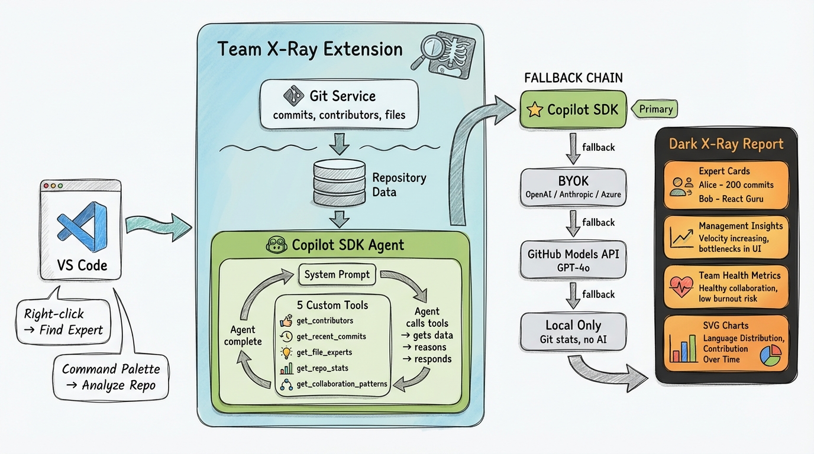

# Team X-Ray

> *"Feeling like a stranger on my own team, surrounded by brilliant minds whose talents hide in code and commits."*

Transform your repository into a team expertise map. Discover who knows what, reveal hidden collaboration patterns, and get AI-powered management insights — all from your git history.

[](https://marketplace.visualstudio.com/items?itemName=AndreaGriffiths.teamxray)

## Features

- **🔍 File Expert Discovery** — Right-click any file to find who knows it best
- **🧠 Team Expertise Analysis** — AI-powered profiles with communication styles, specializations, and collaboration patterns
- **📊 Management Insights** — Actionable recommendations: bus factor risks, growth opportunities, efficiency gaps
- **🤖 GitHub Copilot SDK Integration** — Uses the Copilot SDK with custom tools for deep, context-aware analysis
- **⚙️ Flexible AI Provider Settings** — Default `copilot`, or bring your own key with `byok-openai`, `byok-anthropic`, or `byok-azure` (`github-models` is deprecated)
- **🤖 Agent & Bot Detection** — Automatically identifies bot/agent contributors (Dependabot, Copilot, Renovate) with visual distinction
- **📄 Dark-themed Reports** — Exportable HTML reports with SVG charts and an X-Ray visual identity
- **🛟 Git-Backed Fallback Analysis** — If AI analysis is unavailable, Team X-Ray can still assemble a reduced view from local git history

## How It Works

Team X-Ray reads your local git history — commits, contributors, file ownership — and feeds that data into the GitHub Copilot SDK when available. To use a model outside Copilot, bring your own OpenAI, Anthropic, or Azure key (BYOK). If AI output cannot be produced, it builds a reduced git-based analysis.

> **GitHub Models is deprecated.** Team X-Ray still falls back to it when the Copilot SDK fails and a GitHub token is saved, but new setups should use BYOK.



### AI Provider Flow

| Flow | Mode | Requirements |
|------|------|--------------|
| 1 | **Copilot SDK (`copilot`)** | Copilot CLI installed + authenticated; set `teamxray.cliPath` if the CLI is not on your PATH |
| 2 | **BYOK via Copilot SDK** | `teamxray.aiProvider` = `byok-openai`, `byok-anthropic`, or `byok-azure`; run `Team X-Ray: Set BYOK API Key (Secure)`; set `teamxray.byokBaseUrl` and `teamxray.byokModel` |
| 3 | **GitHub Models (deprecated)** | Still used if a GitHub token is saved via `Team X-Ray: Set GitHub Token`. Use BYOK for new setups |
| 4 | **Reduced local fallback** | No extra setup; basic git-derived analysis only if AI output cannot be produced |

## Installation

```
ext install AndreaGriffiths.teamxray
```

Or [install from the VS Code Marketplace](https://marketplace.visualstudio.com/items?itemName=AndreaGriffiths.teamxray).

**Requirements:** VS Code 1.100.0+, Node.js 20+, and a trusted workspace with git history.

## Usage

| Command / Action | How |
|------------------|-----|
| `Team X-Ray: Analyze Repository Expertise` | Command Palette |
| `Team X-Ray: Show Team Expertise Overview` | Command Palette |
| `Team X-Ray: Analyze This File` | Command Palette |
| `Team X-Ray: Find Expert for This File` | Right-click a file or open editor context menu |
| `Team X-Ray: Set GitHub Token` | Command Palette (deprecated, GitHub Models only) |
| `Team X-Ray: Set BYOK API Key (Secure)` | Command Palette |
| Export report | Click the export button in the analysis webview |

## Documentation

| Doc | Description |
|-----|-------------|
| [Setup](docs/setup.md) | Installation & AI provider configuration |
| [Architecture](docs/architecture.md) | Components, tools, worker threads, bot detection |
| [AI Providers](docs/ai-providers.md) | Copilot SDK, BYOK provider overrides, reduced local fallback, and the deprecated GitHub Models path |
| [Reports](docs/reports.md) | Webview, HTML export, dark X-Ray theme |
| [Troubleshooting](docs/troubleshooting.md) | Common issues & fixes |

## Links

- [VS Code Marketplace](https://marketplace.visualstudio.com/items?itemName=AndreaGriffiths.teamxray)
- [GitHub Repository](https://github.com/AndreaGriffiths11/teamxray)
- [Report Issues](https://github.com/AndreaGriffiths11/teamxray/issues)

---

**Stop being a stranger on your own team.** 🔬
